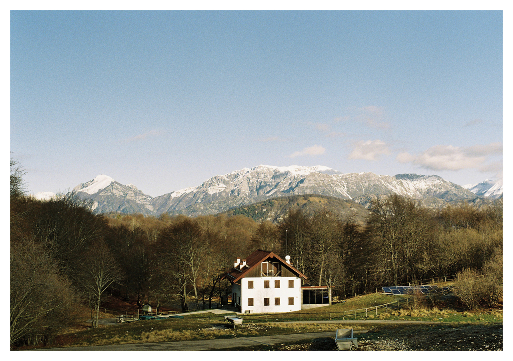
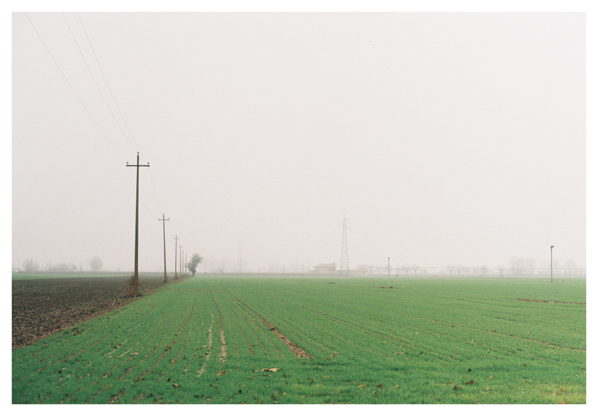

# Hello I'm MedaiP90 👋

## Favorite projects

You may disagree, but the projects in my repo I like the most are:

-  &nbsp; [MQTT5 Explorer](https://github.com/Omniaevo/mqtt5-explorer)

    

-  &nbsp; [Cellular automaton](https://github.com/MedaiP90/game-of-life)

   

There were (and are) some challenges during the development, that's because I like them.

## Hobbies

### My socials

&nbsp;&nbsp;

